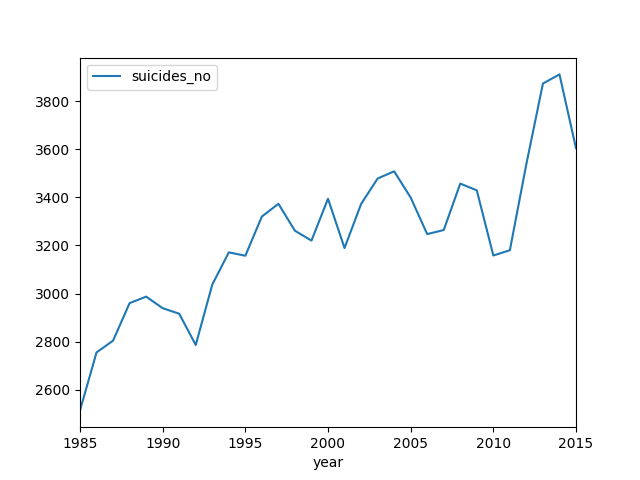
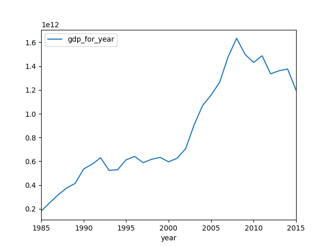

De este dataset me interesaba indagar en las posibles relaciones entre el número de suicidios y los ciclos de de crisis de las distintas economías europeas.

Para ello prcedí a limpiar y adecuar el df, lo que supuso cambiar algunos títulos de columnas que podían dar poblemas por contener espacios, eliminar puntuación de la columna de GDP y convertir sus datos a inntegers para poder operar luego con ellos.

Luego procedí a seleccionar aquellos países que me interesaban por medio de una query para, a continuación, agruparlos para poder extraer el número de suicidios que se producóan por año enc ada país. Este fue uno de los principales escollos, ya que los casos de suicidios estaban agrupados por rangos de edad. Tenía que sumar valores por años y quedarme con solo una fila que contuviera toda la información de cada país.

Una vez solucionado esto introduje un input para que el usuario pudiera elegir el país que más le interesara y que pudiera hacerlo en varias ocasiones para poder comparar.

Por último saqué las gráficas correspondientes a cada dato.

La idea inicial incluía introducir los datos de población anual por cada país que deberían haber venido de la API. No pude conseguir esta información por medio de ninguna API, aunque lo intenté tanto en el BM como en el INE. Al final conseguí la información en un CSV pero no conseguí darle el formato para hacer el merge con los anteriores datos.

