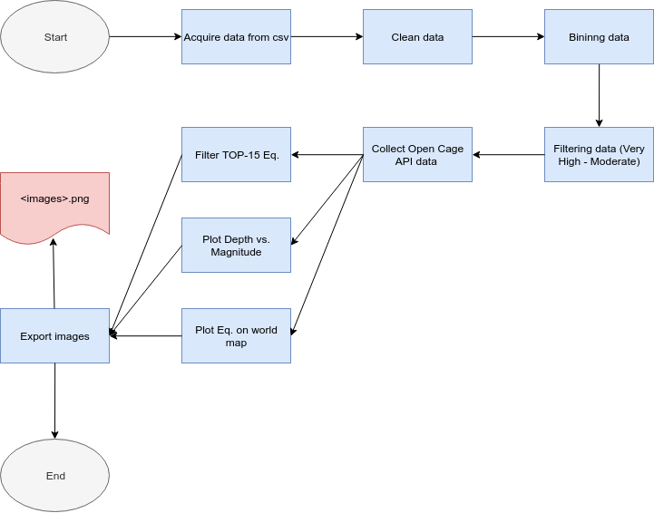

<h1>Seismic Activity</h1>
<h2>(1965-2016)</h2>

An earthquake (also known as a quake, tremor or temblor) is the shaking of the surface of the Earth, resulting from the sudden release of energy in the Earth's lithosphere that creates seismic waves. Earthquakes can range in size from those that are so weak that they cannot be felt to those violent enough to toss people around and destroy whole cities. The seismicity, or seismic activity, of an area is the frequency, type and size of earthquakes experienced over a period of time. The word tremor is also used for non-earthquake seismic rumbling.

At the Earth's surface, earthquakes manifest themselves by shaking and displacing or disrupting the ground. When the epicenter of a large earthquake is located offshore, the seabed may be displaced sufficiently to cause a tsunami. Earthquakes can also trigger landslides, and occasionally volcanic activity.

In its most general sense, the word earthquake is used to describe any seismic event—whether natural or caused by humans—that generates seismic waves. Earthquakes are caused mostly by rupture of geological faults, but also by other events such as volcanic activity, landslides, mine blasts, and nuclear tests. An earthquake's point of initial rupture is called its focus or hypocenter. The epicenter is the point at ground level directly above the hypocenter.

https://en.wikipedia.org/wiki/Earthquake

The data set was selected form kaggel and was selected because it contained clean data, over 23000 entries, and offered an interesting opportunity to research seismic activity on earth.

The main objective of this excercise was to apply learnt lessons on data analysis rather than make significant foindings on the geological field.  The project was structured as a pipeline that started on retrieving the cvs file containing the data to finishing the pipeline with a table of the top 15 most powerfull earthquakes, a world distributions of the earthquakes, and a relational graph between magnitude and depth of the quakes.

https://www.kaggle.com/

* <b>Acquire data:</b> Use of pandas to importa cvs file into a dataframe.
* <b>Clean data:</b> Drop empty and unusefull columns from dataframe.
* <b>Bininng data:</b> Clasify each earthquake by magnitude into 5 bins ramgimg from very low to very high.
* <b>Filtering data:</b> Reduce the number of quakes to less than 800 by filtering out the lower magnitude bins
* <b>Collect Open Cage API:</b> Give the coordenates as parameters and extract the continent, country, and state where the eq occured. 
* <b> Filter Top 15: </b> Select and show the 15 most powerfull eq in th recorded history
* <b> Plot Depth vs. Magnitude: </b> Plot a graph that shows the relation between depth and magnitude and color according to continent.
* <b>Plot Eq's on world map:</b> Place the filtered events on a world map
* <b> Export images: </b> Export images as .png for reports

<h2>Conclusions</h2>
* The earthquakes in the "Very High" magnitude bin occur in the ocean and in Asia. 
* The higher magnitude earthquakes occur in the 0-100km depth range, while the lower magnitude ones occure anywhere between 0-700kms. 
* As described in the wikipedia page, most quakes occur along the faults between tectonic plates. 
* The program took around 250sec to run, so the implementation of ASYNC could make the query mor efficient.