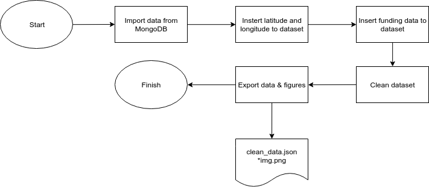
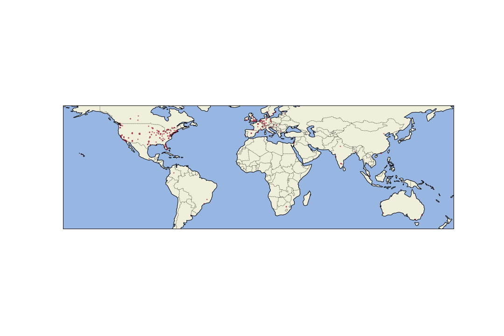
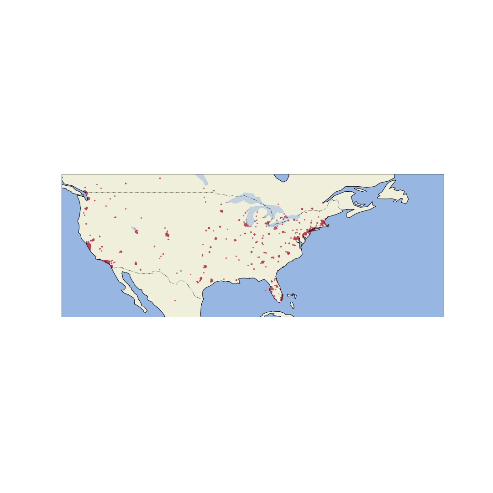
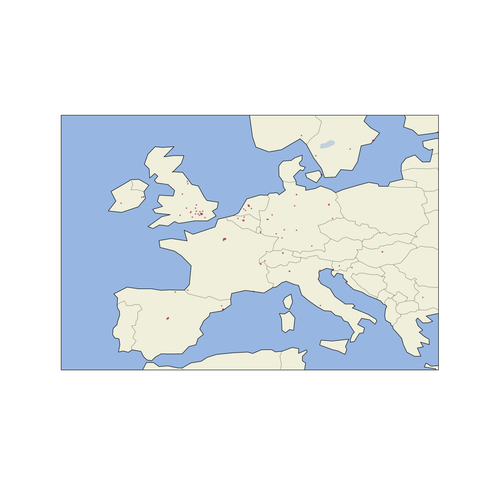
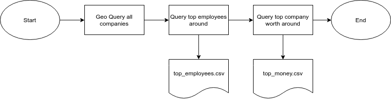

# Tableau Project #

## Objectives: ##
The objective of this project is to find the ideal location for a new video game company.  Since this is a tech company one of th requests is that the devolpers want to work near other small tech companys. On the other hand the management team wants to be near big cpmpanys with important business men around.  The company should be located near "new" busineses.

## Part 1 - Data prep: ##

- **Importing data from MongoDB:** The first step is to call to a function that uses pyMongo to connect python to the local host of MongoDB.  The same function querys the DB and  requests only the columns that provide relevant info to rech the objective.

- **Insert Latitude & Longitude:** The office column contains a dict. of coordenates. For easy of use in Tableau this function extracts each coordenates and places the on new columns labeled "latitude" and "longitude".

- **Insert funding data:**  Similar to the previous step, funding is a dictionary containing relevant data.  We extract the currency and funding amount of each company and place it in new columns.

- **Clean dataset:** After we have all the info we want in the dataset, we clean the data by droping entrys that have Null values on key aspects such as number of employees or coordenates.  We remove duplicates and transform the value of the company from a string to an int value.

- **Export data & figures:**  Here we export the dataset to a json file. We also create several images using CartoPY library placing the companies on a world map.  It is usefull to see clusters of companies for deeper analysis.

## Part 2 - Geo Querys MongoDB ##

- **GeoQuery all comanies:** The function imports all documents from MongoDB and does a 800m radious query for each company.  The query returns the sum of the amount of workers within the radious and the sum of money worth from all the companies in the area.  This is added to two new columns.

- **Query top employees:**  Here we sort the dtaframe and chose the company that has the highest number fo employees in the neighborhood.  Then we do a geoquery of the top company with 5000m radius.  We export this new dataframe as a csv for deeper analysis in Tableau.

- **Query top companys worth:** Similar to the last step we repeat the process but with the companys net worth in mind.