# Supervised Machine Learning Project  

## Heart Disease Diagnostics

### Introduction

Heart disease describes a range of conditions that affect your heart. Diseases under the heart disease umbrella include blood vessel diseases, such as coronary artery disease; heart rhythm problems (arrhythmias); and heart defects you're born with (congenital heart defects), among others.

The term "heart disease" is often used interchangeably with the term "cardiovascular disease." Cardiovascular disease generally refers to conditions that involve narrowed or blocked blood vessels that can lead to a heart attack, chest pain (angina) or stroke. Other heart conditions, such as those that affect your heart's muscle, valves or rhythm, also are considered forms of heart disease.

Many forms of heart disease can be prevented or treated with healthy lifestyle choices.

From: https://www.mayoclinic.org/diseases-conditions/heart-disease/symptoms-causes/syc-20353118

### Project Description

In this project, we want to apply different Machine Learning (ML) algorithms to try to predict if a person suffers from heart disease or not.  To train the program we used a data set from Kaggle that contains information of 70k people. 

**Data Set Features:**

* Age | Objective Feature | age | int (days)
* Height | Objective Feature | height | int (cm) |
* Weight | Objective Feature | weight | float (kg) |
* Gender | Objective Feature | gender | categorical code |
* Systolic blood pressure | Examination Feature | ap_hi | int |
* Diastolic blood pressure | Examination Feature | ap_lo | int |
* Cholesterol | Examination Feature | cholesterol | 1: normal, 2: above normal, 3: well above normal |
* Glucose | Examination Feature | gluc | 1: normal, 2: above normal, 3: well above normal |
* Smoking | Subjective Feature | smoke | binary |
* Alcohol intake | Subjective Feature | alco | binary |
* Physical activity | Subjective Feature | active | binary |
* Presence or absence of cardiovascular disease | Target Variable | cardio | binary |

All of the dataset values were collected at the moment of medical examination.

link: https://www.kaggle.com/sulianova/cardiovascular-disease-dataset

This data set was selected because it contained clean numeric data, so we could focus on training the algorithms rather than cleaning the data.

**Pipeline:**

### Results 

Checking data output shows that the data is clean, numeric and ready for Machine Learning.

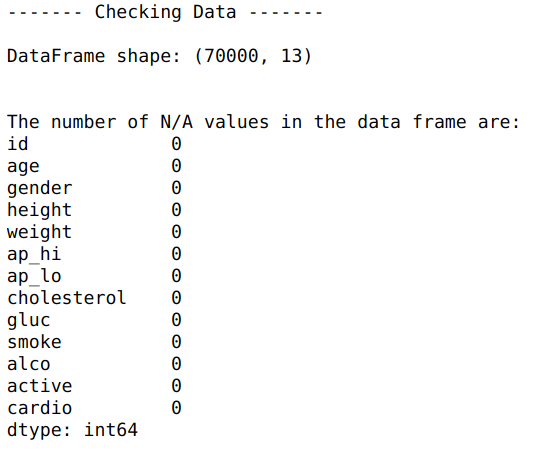

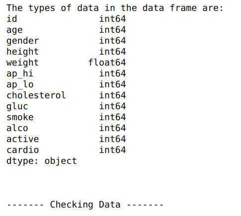

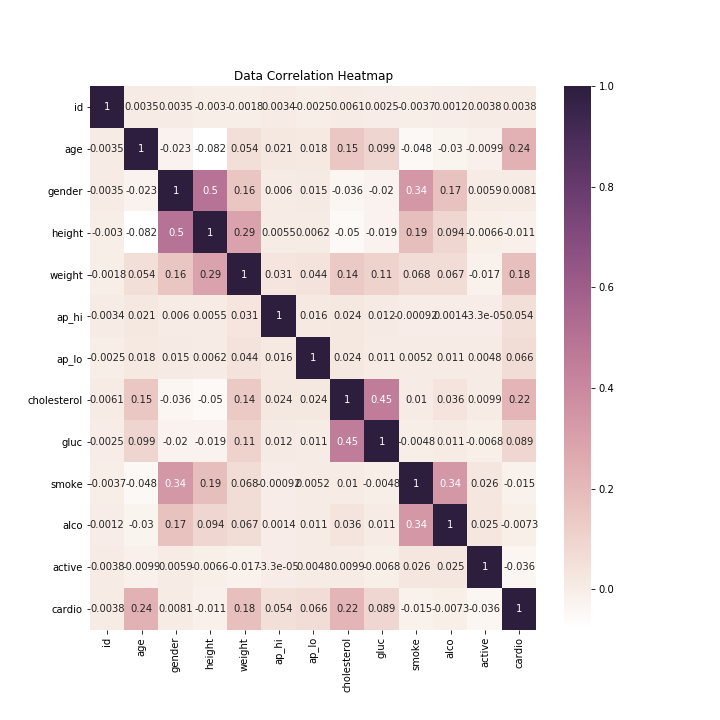

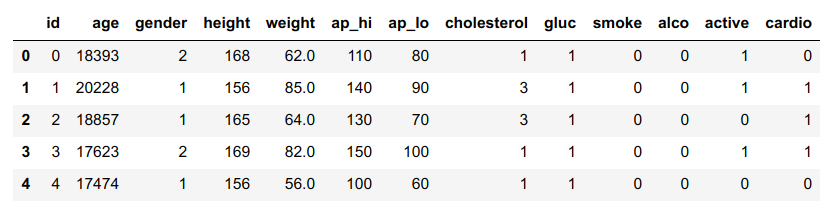

After the cross value tests for the selected models, the results showed that the Random Fores gave the best results for the 3500 data points.

The grid search on the Random Forest was done 3 times changing the **max_depth** & **n_estimators** values.

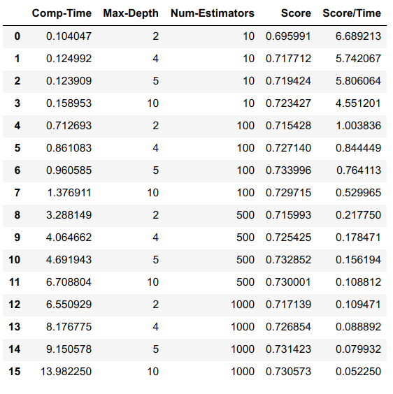

It is evident that the higher number of estimators and max depth output 3% better results, but the computational time is affected at almost 140 times.  For that reason we chose to do another grid search limiting the number to **max_depth = [3,4,5]** & **n_estimators = [4,10,50,100]**

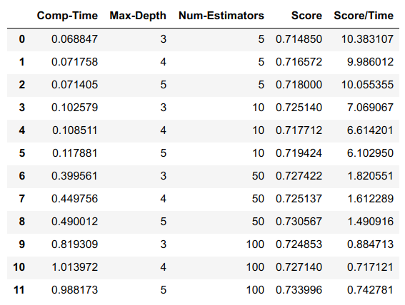

In the third grid search we chose **max_depth = [4,5]** & **n_estimators = [20,30,40,50]**

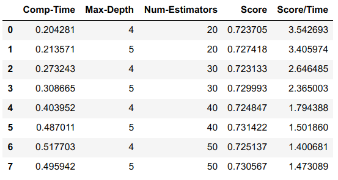

With this grid search, we have consistent results at around 73%.  We chose **n_estimators = 30** and **max_depth = 5** for the model with a computing time of 0.3s for 3500 points.

We ran the model with 80% of the complete data set for training and 20% for the test.

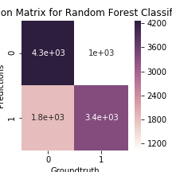

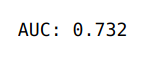

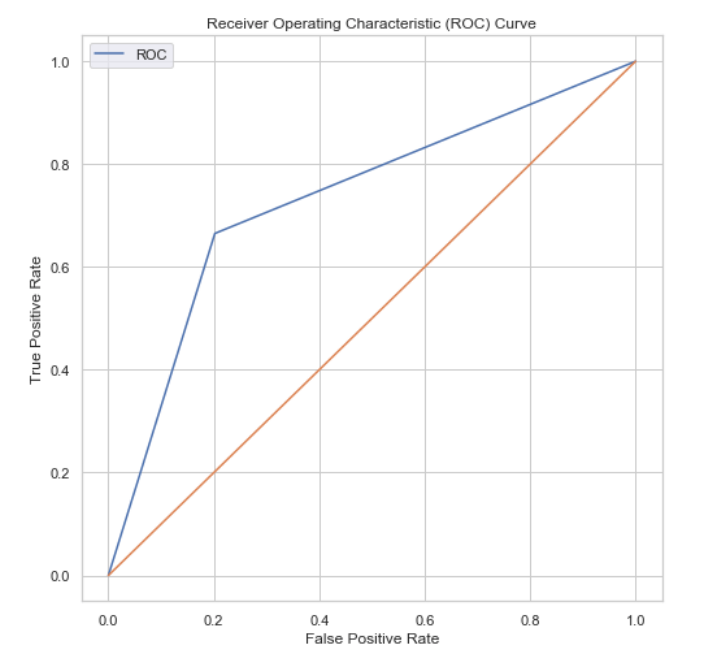

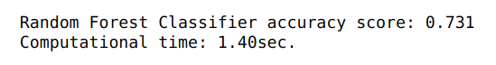